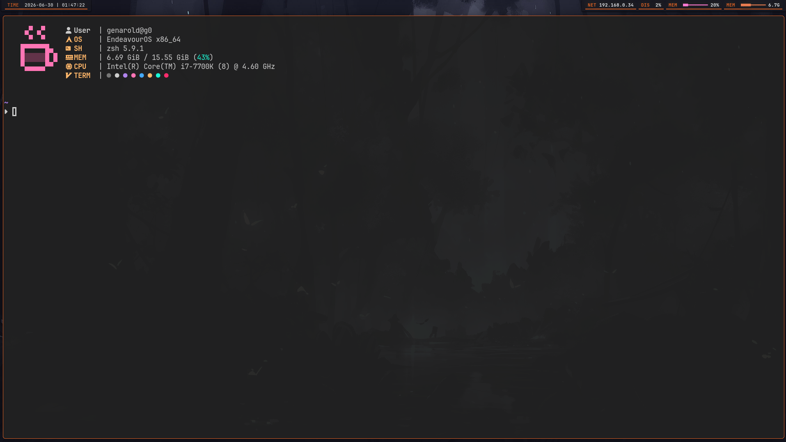
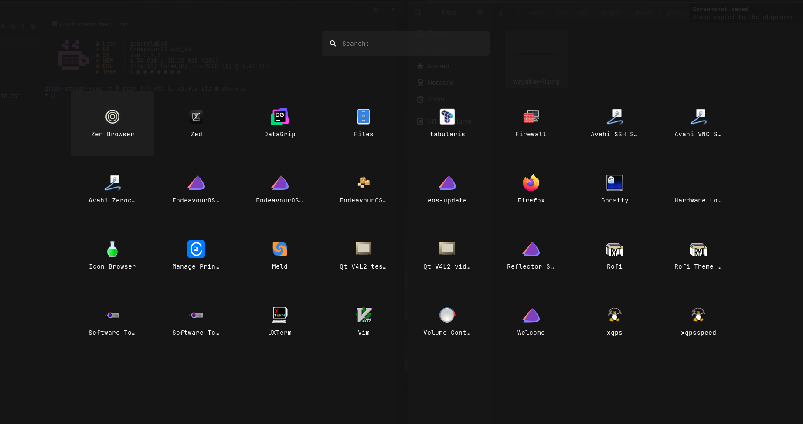
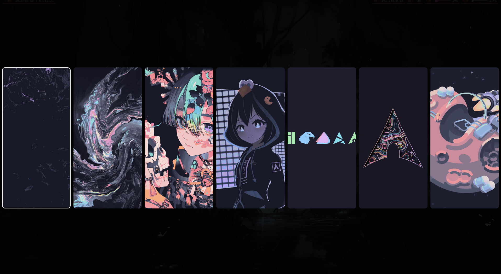
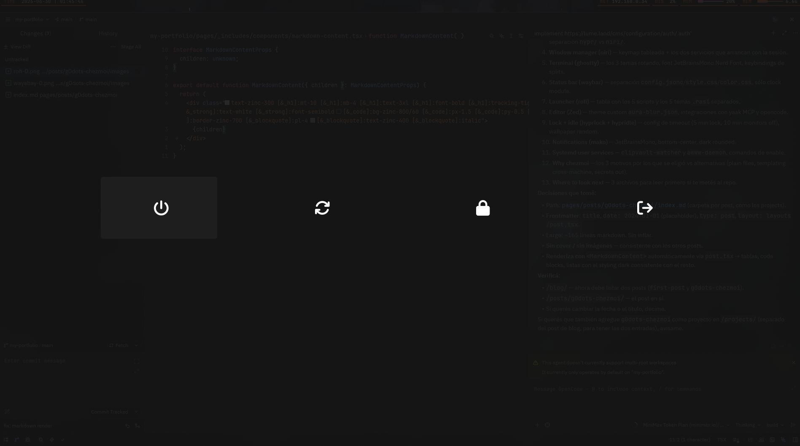

My personal dotfiles managed with [chezmoi](https://www.chezmoi.io/). This
post walks through the install process, the directory layout, and how each
piece fits together — useful if you're considering chezmoi for your own
setup, or just curious how a Wayland-focused Linux desktop hangs together.

## Install

```bash
./install.sh
```

The script does five things, in order:

1. Updates the system with `paru` (Arch-based AUR helper).
2. Installs the rest of the dependencies through `paru`.
  3. Installs the SilentSDDM login theme.
4. Installs `zed` and `opencode` from their respective sources.
5. Applies the dotfiles tracked in this repo.

That's it. No Ansible, no Puppet, no custom DSL — just `chezmoi apply` and
a thin bash entrypoint that calls it after the package layer is ready.

## Architecture overview

Everything lives under `private_dot_config/`, which chezmoi templates
straight into `~/.config/`. The directory map roughly mirrors the system
it configures:

```
private_dot_config/
├── niri/              # Window manager
├── ghostty/           # Terminal + themes
├── waybar/            # Status bar
├── rofi/              # App launcher + scripts
├── mako/              # Notification daemon
├── hypr/              # Screen locker + idle
├── fastfetch/         # System info
├── gtk-3.0/           # GTK3 theme
├── gtk-4.0/           # GTK4 theme
├── zed/               # Editor config + theme
└── systemd/user/      # User services
```

The split between `hypr/` (locker) and `niri/` (compositor) is unusual
— most setups using niri would store everything under `niri/`. The reason
is that `hyprlock` and `hypridle` are still used here even though the
compositor is niri, because nothing equivalent has matured yet for
scrollable-tiling Wayland compositors.

## Window manager — niri

[niri](https://github.com/YaLTeR/niri) is a scrollable tiling Wayland
compositor — think i3 semantics with a horizontal scroll axis instead of
a tree. Config lives at `private_dot_config/niri/config.kdl`.

The keymap I'm using:

| Key                | Action                       |
| ------------------ | ---------------------------- |
| `Mod+Return`       | Open terminal (ghostty)      |
| `Mod+Space`        | Open app launcher (rofi)     |
| `Mod+V`            | Open clipboard manager       |
| `Mod+B`            | Change wallpaper             |
| `Mod+Shift+Escape` | Power menu                   |
| `Mod+1-9`          | Switch workspace             |
| `Mod+Q`            | Close window                 |
| `Mod+F`            | Maximize column              |
| `Print`            | Screenshot                   |

Two services start automatically with the session: `waybar` for the bar,
and `wl-paste --watch clipvault store` for clipboard history.

## Terminal — ghostty

[Ghostty](https://ghostty.org/) is the daily-driver terminal here. Config
lives at `private_dot_config/ghostty/config`.

Three themes cycle through the rotation:

- `panda` — the default, dark
- `stardust` — warmer dark
- `catppuccin-macchiato` — pastel dark

Font is **JetBrainsMono Nerd Font**, which provides the icons that
waybar, rofi, and prompt glyphs all depend on.

Splits use `ctrl+h/j/k/l` for navigation, `cmd+h/l` for tabs, and
`super+ctrl+h/j/k/l` to resize.



## Status bar — waybar

`waybar` is a 24px bar pinned to the top of the screen. The config is
split across three files for clarity: `config.jsonc` (modules and layout),
`style.css` (geometry and typography), `color.css` (palette tokens — same
colors as the GTK themes so the whole UI stays consistent).

The current setup only ships the clock module. Adding more (network,
battery, audio) is a matter of enabling modules in `config.jsonc` —
their styling is already routed through `color.css`.


## Launcher — rofi

`rofi` does more than launch apps here. It also handles:

| Script              | Purpose                                  |
| ------------------- | ---------------------------------------- |
| `rofi-launcher`     | App drawer (drun mode)                   |
| `rofi-clipboard`    | Clipboard history via clipvault          |
| `rofi-bgselector`   | Wallpaper selector                       |
| `rofi-powermenu`    | Shutdown / reboot / lock / logout       |
| `rofi-confirm`      | Generic confirmation dialog              |

Each script has its own `.rasi` theme — `appdrawer.rasi`,
`powermenu.rasi`, `clipboard.rasi`, `bgselector.rasi`, `confirm.rasi` —
so the visual language can shift per context without rewriting rofi
calls.







## Editor — Zed

`zed` is configured under `private_dot_config/zed/`, including a custom
theme at `themes/aura-blur.json` (Vesper Blur base with a darker
overlay).

Two integrations worth noting:

- **yaak MCP server** for remote AI assistance.
- **opencode agent server** for in-editor coding workflows.

Both are wired through Zed's settings, not external scripts.

## Lock + idle — hyprlock + hypridle

`hyprlock` config sits at `private_dot_config/hypr/hyprlock.conf`,
`hypridle` at `hypridle.conf`. The lock script `lockbg.sh` picks a random
wallpaper from `~/.config/niri/walls` and shows a face icon sourced from
the SDDM theme.

Idle behavior:

- 5 minutes idle → lock screen
- 10 minutes idle → monitors off

On wake, niri is configured to bring monitors back up so the session
isn't stranded on a black screen.

## Notifications — mako

`mako` is a tiny Wayland notification daemon. The config sets JetBrainsMono
as the font, positions notifications at bottom-center, and styles them
with rounded corners on a dark surface. Volume / mute notifications route
through the same daemon so audio events get the same visual treatment.

## Systemd user services

Two services are enabled per-user:

- **`clipvault-watcher.service`** — watches clipboard changes and writes
  them to `clipvault`'s store. This is what makes `Mod+V` (or the rofi
  clipboard script) show actual history.
- **`awww-daemon.service`** — the wallpaper daemon. Waybar and the
  rofi bgselector both rely on it being up.

Both services live at `~/.config/systemd/user/` and can be enabled with
`systemctl --user enable --now <name>.service`.

## Why chezmoi

chezmoi was picked over alternatives for a few reasons:

- **Plain files**: dotfiles stay readable, diffable, and reviewable on
  GitHub. No special DSL to learn.
- **Cross-machine templating**: the same repo can target different hosts
  via `chezmoi init` + `.chezmoi.toml` overrides.
- **Secrets handling**: secrets stay out of the repo, sourced from
  environment variables or `pass` at apply time.

The trade-off is that anything too dynamic (live workspace state,
ephemeral tokens) doesn't fit the model and stays out of the repo.

## Where to look next

If you're curious about a specific piece, the most self-contained ones
to read first are:

- `private_dot_config/rofi/` — small, scoped scripts with their own
  themes. Good template for adding a new rofi mode.
- `private_dot_config/hypr/lockbg.sh` — short bash glue between hypridle
  and aww / random wallpapers.
- `private_dot_config/zed/themes/aura-blur.json` — a custom theme on
  top of an existing one, useful as a starting point for your own.
